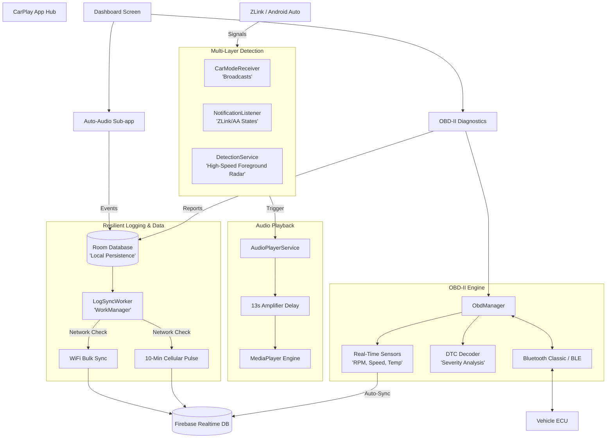

# CarPlay

A modular Android "super-app" targeting Android 16 (API 36), designed to interface with Android Auto and Android Automotive systems.

The application acts as a central hub (Dashboard) for various car-related sub-apps and features, providing a scalable architecture for adding new functionalities.

## Architecture

*   **Modular Super-App:** The app uses a single `:app` module with clean package separation (`core`, `navigation`, `ui`, `feature`). This enables easy scalability without the overhead of a multi-module Gradle build.
*   **UI Layer:** Built purely with modern Jetpack Compose, featuring a premium dark-first automotive theme to reduce glare while driving.
*   **Navigation:** Uses Jetpack Navigation Compose, routing from a central Dashboard grid to independent feature screens.
*   **Dependency Injection:** Manual DI via the `CarPlayApplication` class for simplicity and transparency.
*   **Storage & Resilience:** Offline-first architecture using **Room Database** for local persistence, with **WorkManager** handling intelligent background synchronization to Firebase based on network type (WiFi vs Cellular).

## Current Features

### 1. Auto-Audio Orchestrator
Automatically plays a user-selected audio file over the car's speakers when the phone connects to Android Auto.
*   **Triple-Layer Detection:** Uses a combination of `CarConnection` API, `NotificationListenerService` (for ZLink/AA notifications), and a high-speed **Foreground Radar** that polls active apps every 3 seconds.
*   **Smart Execution:** A Foreground Service waits exactly **13 seconds** to allow physical car amplifier relays and audio routing to fully initialize before requesting AudioFocus and playing the media.
*   **Firebase Logging:** Every connection event and diagnostic signal is logged locally and synced to Firebase for remote debugging.

### 2. OBD-II Vehicle Diagnostics
Reads and decodes real-time vehicle data from Bluetooth ELM327 adapters.
*   **DTC Decoding:** Automatically decodes universal fault codes with human-readable descriptions and severity levels (Minor, Moderate, Severe).
*   **Real-Time Sensors:** Fetches and displays live PIDs including **Engine RPM**, **Vehicle Speed**, **Coolant Temperature**, and **Engine Load**.
*   **Historical Reports:** Automatically syncs full diagnostic reports (DTCs + Sensors) to Firebase and displays historical trends in a user-friendly bar chart.

## Adding a New Feature

The app is built to be easily extensible. To add a new sub-app:
1. Create a new package under `app/src/main/java/com/carplay/feature/yourfeature/`.
2. Define the navigation route in `Screen.kt`.
3. Add the composable entry in `AppNavGraph.kt`.
4. Add a `FeatureItem` card to the grid in `DashboardScreen.kt`.

## Getting Started

*   **Requirements:** Android Studio Meerkat (or newer) supporting Android Gradle Plugin 8.9.0+ and API level 36.
*   **Build:** Open the project in Android Studio. The IDE will automatically synchronize dependencies and generate the required Gradle Wrapper binary. Run `./gradlew assembleDebug` to build.
